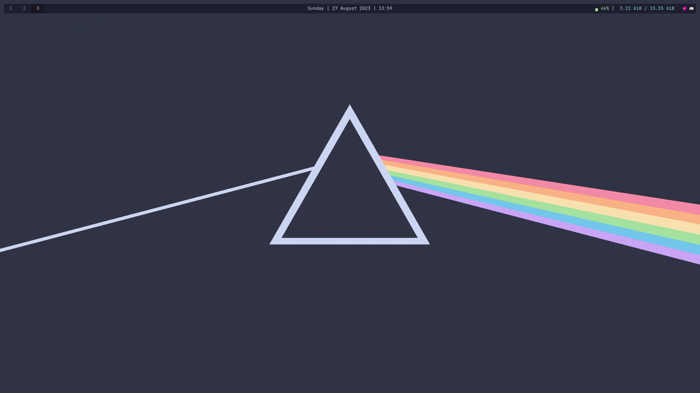

<div align="center">

# Thebigbot Rice

This repository contains all my dotfiles. I use it to configure my system and keep track of the changes I make. 
The theme used is [catppuccin](https://catppuccin.com/).

# Setup
You can install it automatically with the setup (currently in beta)

```bash
curl https://raw.githubusercontent.com/vclemenzi/rice/main/setup.sh | bash
```

Sudo is not required will be prompted with the various steps, setup asks for confirmation several times
</div>
